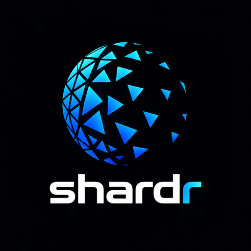

<p align="center"></p>

# shardr

shardr is a decentralized LLM repository with sync-based distribution. It
keeps large language models available and digitally sovereign: artifacts
live in content-addressed storage on your machines, synchronize over a
BitTorrent-based peer network, and serve through an OpenAI-compatible
runtime. A global system operated by its users — independent of any single
provider, with availability that grows with every participating node.

## What shardr provides

**A local content-addressed model repository.** All models on a machine
live in a single store and are addressed by reference (`ns/name:quant`).
Identical files are stored once; every write is verified against its
digest.

**Runtime-independent artifacts.** An artifact contains weights, tokenizer,
chat template, and metadata. Runtime configuration is applied separately at
serve time and is not part of the stored model — so the repository is not
tied to a specific inference runtime. llama-server is supported today;
further runtimes can be added without re-importing existing models.

**Collection management.** `shardr models` lists the inventory with sizes
and quants, `shardr verify --all` re-hashes the store on demand, and
`shardr pull` retrieves missing artifacts when needed.

**Distribution.** Artifacts synchronize between shardhive instances over a
BitTorrent-based peer network; availability grows with every participating
node (see [Synchronization & integrity](#synchronization--integrity)).

## Components

| Component | Kind | Status |
| --- | --- | --- |
| `shardhive` | Storage daemon — content-addressed store (CAS), imports (local / Hugging Face / BitTorrent), sync client, API v1 over a 0600-mode Unix socket | working |
| `shardr` | Model runtime & CLI — run/serve/stop lifecycle, layered runtime configuration, zero-copy serving via llama-server | working |
| `shardrbay` | Discovery index over the peer network | planned |
| `shardr build` | Modelfile composition — adapters and templates into distributable model images | planned |

## Setup

```sh
go build -o sh-bin/shardr ./cmd/shardr
go build -o sh-bin/shardhive ./cmd/shardhive
make llama        # builds the llama-server pinned in runtime/llama.lock into bin/
                  # or: any llama-server in $PATH, or $SHARDR_LLAMA_SERVER
```

Start the storage daemon (all clients communicate with it over a
mode-0600 Unix socket; `$SHARDR_SOCKET` overrides the path):

```sh
shardhive serve
```

On start, shardhive begins sharing every complete artifact it holds
(startup sync).

## Adding models

```sh
# local files (regular files only — symlinks are refused; the quantization
# is derived from the filename, the model family from the stem)
shardr import local ~/Models/qwen3.5-9b-q8_0.gguf --as qwen/test

# Hugging Face (the commit SHA is pinned as provenance; identical
# classification rules apply)
shardr import hf Qwen/Qwen3-4B-Instruct-GGUF

# BitTorrent (the manifest pin is mandatory — a bare magnet link is never
# accepted)
shardr import bt "magnet:?xt=…" --manifest sha256:ab…

shardr models          # inventory: namespaces, quants, sizes
shardr status          # job progress / recent jobs
```

## Serving models

```sh
shardr run qwen/test:q8_0              # foreground, Ctrl-C = clean shutdown

shardr serve qwen/test:q8_0 --id mainllm   # background instance
curl http://127.0.0.1:<port>/v1/chat/completions \
  -H 'Content-Type: application/json' \
  -d '{"model":"shardr:///qwen/test:q8_0","messages":[{"role":"user","content":"Hi"}]}'
shardr stop mainllm                    # SIGTERM within 30 s, then SIGKILL
```

The short reference is canonicalized, resolved and ensured against the
daemon; llama-server then maps the weights **directly from the CAS** — no
additional copies are written to disk. The served model id is the canonical
reference.

### Runtime configuration — four layers

Lowest to highest precedence: advisory defaults from the artifact →
`~/.config/shardr/config.toml` (`[runtimes.llama]`, per-model
`[models."ns/name:quant"]`) → `--config file.toml` → `--set key=value`.

```sh
shardr run qwen/test:q8_0 --set llama.n_gpu_layers=40 --set llama.ctx_size=32768
```

Keys are validated against the 002 §7.1 allowlist (`n_gpu_layers`,
`ctx_size`, `n_threads`, `flash_attn`, `mlock`, `kv_cache_type`,
`batch_size`, `ubatch_size`, `n_parallel`, `jinja`, `mmproj_variant`).
Unknown keys fail loudly, naming the layer they came from. Bool keys are
tri-state: absent = inherit, `true` = pass flag, `false` = omit flag
(the runtime default applies — not "off").

## Synchronization & integrity

Sharing is enabled by default: every complete artifact contributes to global
availability. Configure `[swarm]` in `config.toml` (`seed`, `upload_limit`,
`dht`). Missing content is filled automatically — CAS hit → import → peer
network (`shardr pull <ref>` fills without serving).

```sh
shardr verify --all     # integrity re-hash (exit 0 clean, 1 mismatch, 2 missing)
```

Trust derives from digests, never from transports: every byte is verified
against its content address on write, and BitTorrent imports require a
pinned manifest digest.

## llama.cpp versioning & runner releases

The llama.cpp version shardr builds and ships is pinned in
[`runtime/llama.lock`](runtime/llama.lock) — the single version truth
(ref + full commit SHA + source-archive SHA-256, parsed fail-closed by
`internal/llamalock`; no second pin in Makefile or Go constants).

Two strictly separated channels:

- **Release channel** — a daily check (workflow
  `llama-upstream-check`) detects new exact `vX.Y.Z` tags and opens a
  lockfile update PR (old/new ref, both SHAs, upstream compare link,
  archive digest). Merging that PR — after the build/E2E matrix
  (Ubuntu x86-64 CPU, macOS Apple Silicon Metal) ran on it — triggers
  `release-runner`, which publishes
  `shardr-runner-<shardr-version>-llama-<ref>` bundles with SHA256SUMS,
  BUILDINFO.json and licenses. Existing releases are never overwritten;
  same identity with different bytes is a hard error. A moving `latest`
  is never published.
- **Canary channel** — `llama-nightly-canary` tests the newest `bNNNN`
  nightly once a week through the same matrix, never touches the stable
  lockfile and never publishes a release.

Manual update: `go run ./cmd/llama-lock check-update --write --ref vX.Y.Z`
(exact tags only), then open a PR against `main`. Verify a lockfile with
`go run ./cmd/llama-lock validate`.

## Specifications & documentation

Design contracts live in [`docs/specs/`](docs/specs/) — see the
[spec index](docs/specs/README.md) for surface statuses. Reference scheme &
URI grammar (000), artifact format (001), runtime & configuration (002),
CAS (003), peer synchronization (004), interface & resolution (005).

## Status

Operational end-to-end: import → CAS → synchronization → `shardr run` with
a real GGUF and a real llama-server (verified with a 7.7 GB model). Not yet
built: `shardr build` (Modelfile composition), shardrbay, mlx/vllm
runtimes, CAS garbage collection.
