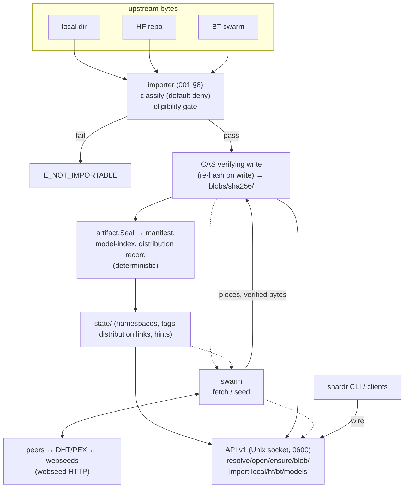

# Architecture

How the pieces fit, derived from the current build. Protocol behavior
is specified in [docs/specs/](../specs/); this page is the code-level
view.

## Components

- **`cmd/shardhive`** — the daemon binary: CLI dispatch (`serve`,
  `cas verify`, `version`), config loading, wiring of CAS + swarm +
  API. Also owns the `cas verify` exit-code contract (003 §4).
- **`internal/cas`** — content-addressed store (003): digest-addressed
  blobs, verifying write path, state files (namespaces, tag aliases,
  distribution links, hints), verification.
- **`internal/ref`** — reference grammar (000): parse, canonicalize,
  selector resolution. The spec vectors run against this package.
- **`internal/artifact`** — artifact format (001): manifest/index/
  distribution-record types, deterministic construction (`Seal`,
  `SortFiles`), and the exported validation rule set (`validate.go`,
  `E_VALIDATION*` classes) shared by the importer, the API, and the
  spec vectors.
- **`internal/importer`** — import machinery (001 §8): default-deny
  classification, eligibility gate, quant derivation chain, local and
  HF sources, convergence-proven pipeline.
- **`internal/swarm`** — BitTorrent v2 client (004): torrent engine,
  CAS-backed storage driver, webseed listener (HTTP), fill engine,
  seed lifecycle, distribution-record reconstruction.
- **`internal/api`** — shardhive interface (005): HTTP over Unix
  socket, job model, error envelope, endpoint handlers.
- **`internal/specvectors`** — vector harness: runs the JSONL suites in
  `docs/specs/vectors/` against the production packages.

## Data flow

## Resolution order (005 §6)

`/v1/resolve` and `/v1/open` resolve strictly against local state:

1. **Local state** — namespaces (`ns/name` → index digest) and
   per-repository tags (`ns/name:tag` → index digest).
2. Configured resolvers would come next — **not implemented in this
   build**; resolution fails loudly (`E_UNKNOWN_REF`) instead of ever
   touching the network.
3. The member selector resolves against the model-index blob
   (`name:quant` / `name:tag+quant` → manifest digest). The `@sha256:<hex>`
   form skips all of this: the digest is the answer.

`/v1/ensure` then makes a resolved model complete: local presence
first, swarm fill for the missing remainder.

## Trust model

- **Digests instead of transports.** Every byte entering the CAS is
  re-hashed on write against its content address — regardless of
  whether it came from disk, HF, a webseed, or a peer. The transport is
  never trusted; the digest always is.
- **Pin-before-join** (BT imports): a manifest digest pin is mandatory
  before the swarm is joined. The swarm decides where bytes come from;
  the pin (and the verifying write path) decides whether they are
  right.
- **Blob hygiene, not immutability.** Blob files are written mode 0444
  and are never mutated in place by shardhive write paths — but a file
  mode is hygiene, not a guarantee: the owner, privileged processes, or
  failing hardware can still change bytes. Integrity is proven by
  digest verification (verifying write path; `shardhive cas verify`
  re-hashes on demand), never by the file mode.
- **The socket is the management boundary.** API v1 lives on a 0600
  Unix socket — file permission is the access control; the management
  API has no TCP surface. (The swarm client does open network
  listeners: a BitTorrent peer listener — TCP + uTP on all interfaces,
  ephemeral port — and a webseed HTTP listener on
  `127.0.0.1:<ephemeral>`; see [swarm](../user/swarm.md).)
- **State is never silently rebuilt.** A corrupt index or unreadable
  state file is a loud error (`E_INVALID_INDEX`, verify state errors),
  never a quiet rebuild that would mask corruption.

## Determinism (import convergence, 001 §7.5)

Same upstream bytes + same classification ruleset version →
byte-identical manifests, indexes, and distribution records, on every
node. The ruleset version is pinned into every import's annotations
(`ClassificationSpecVersion`); bumping it is a protocol decision that
deliberately breaks convergence with older imports. The gold tests
(golden files) and the spec vectors pin this property.
