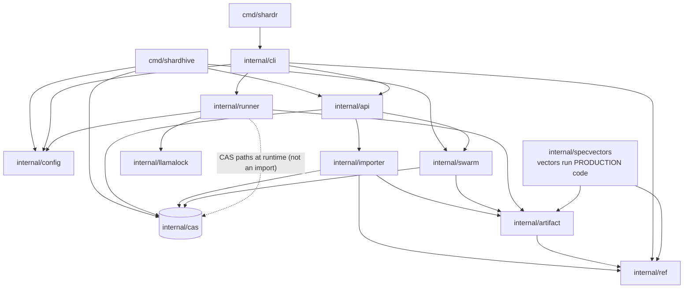

# Code layout

Module path: `github.com/Cyb3rDudu/shardr`. Go ≥ 1.25 (see go.mod). CGO is
used on Darwin only, for precise process-start identity
(`internal/runner/starttime_darwin.go`, libproc); other platform
paths stay pure Go.

```
cmd/
  shardhive/        daemon binary: CLI dispatch, config loading, wiring
                    (main.go, config.go — the [swarm] parser)
  shardr/           model runner & management CLI (005 §4): run/serve/
                    stop lifecycle, import/pull/models/verify/status
                    (main.go) — a client of the daemon API like any other

internal/
  api/              shardhive interface (005): Server, routes, job model,
                    error envelope, endpoint handlers; e2e swarm tests
  artifact/         artifact format (001): types, Seal (deterministic
                    construction), validate.go (exported E_VALIDATION*
                    rule set — importer, API, and spec vectors share it)
  cas/              content-addressed store (003): blobs, verifying write
                    path, state (namespaces/tags/links/hints), verify
  cli/              shardr client commands: run.go (run/serve/stop
                    lifecycle), commands.go (pull/models/verify/status,
                    imports), client.go (daemon client + ref
                    canonicalization incl. default_selector)
  config/           config.toml parser shared by daemon and runner
  importer/         import machinery (001 §8): classify.go (default-deny
                    classification), quant.go (derivation chain),
                    local.go (hard boundary), hf.go (pinned HF client),
                    importer.go (pipeline), gold_test.go (convergence)
  llamalock/        runtime/llama.lock parser — the single llama.cpp
                    version truth (fail-closed)
  ref/              reference grammar (000): Parse/ParseShort/Resolve,
                    error classes shared with the vectors
  runner/           llama runtime (002): llama.go (spawn/readiness),
                    overlay.go (4-layer config merge, §7.1 allowlist),
                    registry.go (serve instances, stop identity check)
  specvectors/      vector harness: runs docs/specs/vectors/*.jsonl
                    against the production packages
  swarm/            BitTorrent v2 client (004): swarm.go (client,
                    config, webseed), fill.go (fill engine + re-seed)

docs/
  specs/            design specs 000–005 + vectors/ (JSONL suites)
                    — the protocol source of truth
  user/             using shardhive (this doc set)
  dev/              working on the code (this page)

site/
  shardrbay/        planned web index (placeholder)

cmd/shardhive/config.go parses only [swarm]; [references]/[runtimes.*]/
[models.*] belong to other components (see docs/user/config.md).
```

Package dependency shape (no cycles; the spec vectors sit on top of
production code, never beside it):



Where behavior lives, by question:

- "What does this reference mean?" → `internal/ref`
- "Is this artifact valid?" → `internal/artifact/validate.go`
- "Which upstream files become what?" → `internal/importer/classify.go`
- "Where do bytes live on disk?" → `internal/cas` (003 §2 layout)
- "What runs on the wire?" → `internal/api` (005 §3)
- "How does the swarm map to the CAS?" → `internal/swarm` (004)
- "How does a model get served?" → `internal/cli/run.go` +
  `internal/runner` (002)
- "Which llama.cpp is shipped?" → `internal/llamalock` +
  `runtime/llama.lock`
