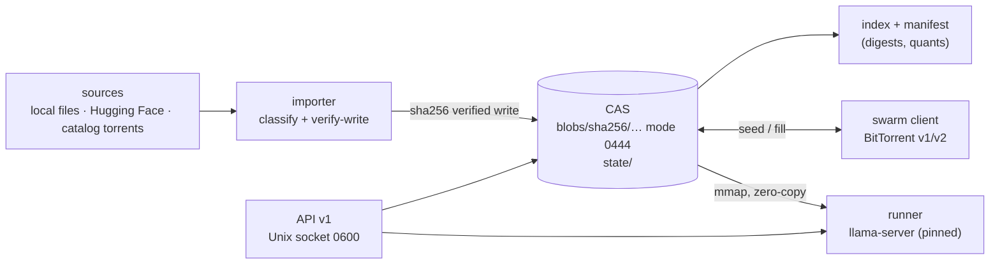

# Concept tour

The implemented flow from source bytes to a served model. Four ideas
carry the system: content-addressed storage, digests as the trust
anchor, zero-copy serving, and swarm synchronization. Everything here
describes behavior that exists in the code; the canonical contracts
are the specs linked throughout.

## The flow at a glance



## Content-addressed storage

Every artifact — weights, manifests, model configs, even the indexes —
is stored by the SHA-256 of its bytes:
`<cas>/blobs/sha256/<2-hex>/<62-hex>`, mode 0444. Identical bytes are
stored once and only once, whatever their filename or origin. The
store's shape and rules are
[spec 003](https://github.com/Cyb3rDudu/shardr/blob/main/docs/specs/003-cas-format.md).

Writes are verifying and atomic: bytes stream to `incoming/<random>.part`
while the hash is computed; a digest mismatch deletes the part; a
match fsyncs, chmods 0444, and atomically renames into `blobs/`.
Partial data is never promoted, never trusted, never seeded. Observed
on a real store:

```console
$ ls -l <cas>/blobs/sha256/ed/
-r--r--r--  1 dudu  staff  105454144 … 5fa30c487b282ec156c29062f1222e5c20875a944ac98289dbd242e947f747
```

## Digests are the trust anchor

A reference (see the [URI grammar](../references/uri-references.md))
resolves to digests, and digests are verified end to end — at import
(verify-write), on swarm arrival (piece hashes, then the anchor gate
for catalog pulls), and on demand (`shardr verify`, an explicit re-hash
with exit codes 0/1/2). "Trusted" means *written by the verifying path
or fully re-hashed since* — never file permissions, never a source's
say-so. Before a blob is first offered to the swarm, the daemon
re-hashes it: disk corruption must never silently become swarm
corruption.

Name authenticity is deliberately honest about its limits: a digest
proves "these bytes match this hash", not "this hash really is
`owner/repo:q8_0`". Binding names to digests rests on the local
namespace state (what you imported), the Hugging Face tree anchor for
catalog pulls, or an explicit `@sha256:…` pin — the one
unconditionally trustworthy form (005 §6).

## Zero-copy serving

The runner does not copy weights out of the store. `/v1/open` hands
out the CAS blob paths; llama-server mmaps them directly:

```console
$ shardr serve shardr:///gold/smollm2-135m-instruct:q4_k_m
resolve shardr:///gold/smollm2-135m-instruct:q4_k_m
spawn <worktree>/bin/llama-server
  weights <cas>/blobs/sha256/ed/5fa30c48… (zero-copy mmap)
```

Immutability by contract (plus 0444) makes the mmap race-free and lets
processes share pages. One copy per machine, owned by shardhive
(003 §5); remote clients stream ranges over `/v1/blob` instead.

## Synchronization: usage is replication

Every imported artifact maps to a torrent (spec 004); a node with the
swarm enabled (the default) seeds everything it holds and can fill
missing blobs by ref (`shardr pull ns/name:quant` → `/v1/ensure`).
Because serving mmaps the same CAS bytes the swarm reads, *using* a
model already replicates it — there is no second copy to upload.

Two populations, two budgets (see [swarm operation](../operations/swarm.md)):

- your own shardr swarm (BitTorrent v2, `[swarm] upload_limit`),
- community catalog swarms joined by pirateface pulls (BitTorrent v1,
  good-citizen seeding after the pull, `[catalog] upload_limit` with
  `[swarm]` inheritance).

Catalog pulls are anchored: the daemon never trusts a listing's
magnet alone — expected digests come from the Hugging Face tree at the
revision the listing pins, and every file is verified against them
before it enters the store (details in
[Catalog pulls](../user/catalog.md)).

## Runner lifecycle

`shardr run` (foreground) and `shardr serve --id` (background
instance) resolve the reference, spawn the pinned llama-server
subprocess (found next to the `shardr` executable — the version truth
is `runtime/llama.lock`, never a system llama), and supervise it.
`shardr stop` enforces the duty: SIGTERM, clean exit within 30 s,
SIGKILL after — with pid identity verification before any signal, so a
stale registry entry or pid reuse can never make it kill the wrong
process. The runtime identifies itself in every completion
(`system_fingerprint: b10684-cc83d7b48`), so what answered is
traceable to what was stored and which runtime served it.
